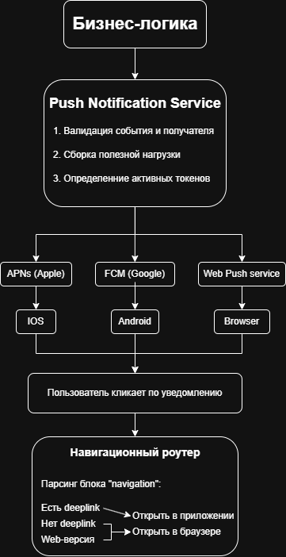

## Задание 1: Анализ требований

### 1. Неточности и противиречия.
- Пункт 2 и 9. 

Проблема: Во 2-ом пункте строгое ограничение на кол-во товара в корзине минимум 1, удаление товара по отдельной кнопке. Но 9-ый пункт говорит об обратном, если кол-во товара уменьшается до 0, то товар автоматом удаляется.

- Пункт 7 и 13.

Проблема: В 7-ом пункте цена при добавлении товара фиксируется и не меняется. Но в 13-ом пункте цены автоматические обновляются у всех юзеров. Оба варианта одновременно реализовать невозможно.

- Пункт 5 лишний/дублирует информацию из пункта 3, но с другой формулировкой.
- Пункт 6. Непонятно на какой из пунктов (1, 3 или 4) распространяется сообщение с лимитом. Нет конкретики, например, 'Превышено суммарное количество всех товаров в корзине. Максимум - 20шт.'.
- Пункт 11. Временные рамки явно не объявленны, по какому часовому поясу считать, и что будет на выходных или днём/ночью? Вопросов больше чем ответов.
- Проблемы с нумерацией, после 11-го пункта следом идёт 13-ый.

### 2. Исправленная версия ТЗ.

1. Ограничения корзины.
1.1 Количество уникальных товаров в корзине не может превышать 5.
1.2 Количество единиц одного товара в корзине не может превышать 10шт.
1.3 Суммарное количество всех единиц товаров в корзине не может превышать 20шт.

2. Удаление и изменение товаров.
2.1 Изменение количества товаров допускается только в пределах от 1 до 10шт (целые числа).
2.2 Удаление товара осуществляется отдельной кнопкой.

3. Ошибки и лимиты.
3.1 При попытке превысить лимит уникальных товаров: 'В корзине может быть не более 5 разных товаров'
3.2 При попытке превысить лимит в 10 шт. на каждый уникальный товар: 'Нельзя добавить более 10 единиц одного товара'
3.3 При попытке превысить общий лимит товаров: 'Общее количество товаров в корзине превышает допустимую норму - 20шт'

4. Основная информация и стоимость.
4.1 На странице корзины отображается список товаров, их количество, цена за единицу и общая стоимость позиции.
4.2 На странице корзины отображается итоговая стоимость всех товаров.
4.3 При изменении цены на товар в каталоге, стоимость товара в корзине автоматически обновляется.

5. Реклама и маркетинг.
5.1 На странице корзины предусмотренно место под блок рекламы.
5.2 В блоке рекламы отображаются только товары из каталога, которые не представленны в корзине.
5.3 Логика отображения рекламы:
- Только в будние дни (с понедельника по пятницу)
- В период с 8:00 до 12:00 и с 18:00 до 22:00 (по часовому поясу пользователя)
- В неактивный период блок рекламы должен скрываться

### 3. Уточняющие вопросы.

1. *Удаление товара*: Если пользователь нажимает на кнопку уменьшения кол-ва товара, где уже стоит '1', то кнопка должна становиться неактивной или должна триггерить предложение удалить товар?
2. *Ценообразование*: По итогу, при изменении цены на товар в каталоге, цена товара в корзине изменяется или остаётся фиксированной? Если фиксируется, то на какой срок?
3. *Реклама*: Каковы точные часы и таймзоны для показа рекламы? Что должно отображаться в будние дни, например, ночью или в выходные? Блок рекламы должен оставаться пустым, скрываться или показывать рекламу от спонсоров?
4. *Валидация товаров*: Как лимиты относятся к фактическим остаткам на складе? На случай, если на складе осталось 5шт. единиц товара, а пользователь захочет 7шт., мы должны выдать ошибку или разрешить накликать столько, сколько захочет?

## Задание 2: проектирование API
### 1. Пример REST API запроса
**GET** /api/v1/partners/shops?address_id=address_example

Host: api.petrushka_zelenaya.com

Authorization: Bearer token_example

Accept: application/json

### 2. Пример ответа REST API
```
{
  "status": "success",
  "data": {
    "title": "Выберите ваш магазин",
    "shops": [
      {
        "id": "metro_1",
        "name": "METRO",
        "logo_url": "https://metro_example.com/logo/metro.png",
        "delivery": {
          "type": "common",
          "is_fast": false,
          "text": "Ближайшая доставка сегодня 21:00-23:00"
        },
        "navigation": {
          "web_url": "https://metro_example.com",
          "deeplink": "metro://open/shop/1"
        }
      },
      {
        "id": "ashan_2",
        "name": "Ашан",
        "logo_url": "https://ashan_example.com/logo/ashan.png",
        "delivery": {
          "type": "common",
          "is_fast": false,
          "text": "Ближайшая доставка сегодня 18:00-20:00"
        },
        "navigation": {
          "web_url": "https://ashan_example.com",
          "deeplink": "ashan://open/shop/2"
        }
      },
      {
        "id": "vkusvill_3",
        "name": "ВкусВилл",
        "logo_url": "https://vkusvill_example.com/logo/vkusvill.png",
        "delivery": {
          "type": "fast",
          "is_fast": true,
          "text": "Быстрая доставка от 20 до 60 минут"
        },
        "navigation": {
          "web_url": "https://vkusvill_example.com",
          "deeplink": "vkusvill://open/shop/3"
        }
      },
      {
        "id": "victoria_4",
        "name": "ВИКТОРИЯ",
        "logo_url": "https://victoria_example.com/logo/victoria.png",
        "delivery": {
          "type": "common",
          "is_fast": false,
          "text": "Ближайшая доставка сегодня 17:00-19:00"
        },
        "navigation": {
          "web_url": "https://victoria_example.com",
          "deeplink": "victoria://open/shop/4"
        }
      }
    ]
  }
}
```

## Задание 3: архитектура

### 


### AAAuthor
##### [@Legalize-NuclearBombs](https://github.com/Legalize-NuclearBombs)